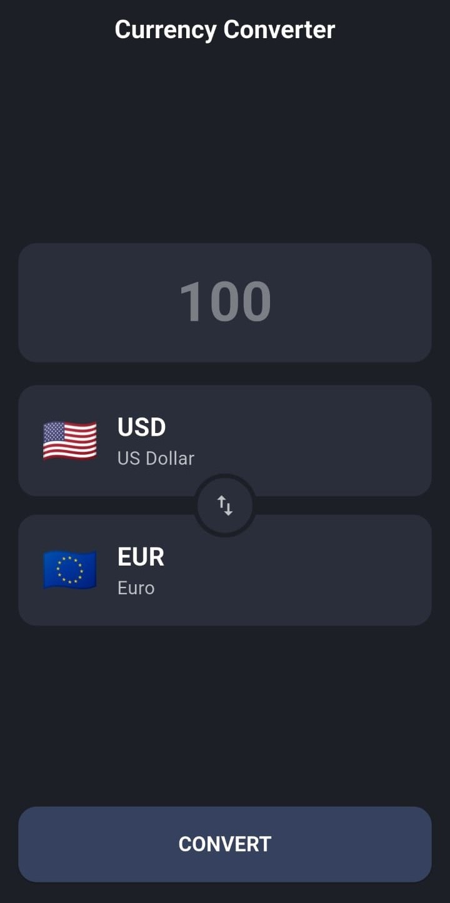

<div align="center">

<!-- APP ICON SECTION -->


# Currency Converter - Flutter

A sleek, modern, and user-friendly currency converter application built with Flutter. It leverages a real-time exchange rate API to provide fast and accurate conversions. The UI is designed with a clean, dark theme for an excellent user experience.

<!-- BADGES -->
<p>
  
  
  
</p>

</div>

---

## 📸 Screenshots

Here's a glimpse of the app in action. The clean, dark-mode interface makes currency conversion a breeze.

 Main Screen                
 


## ✨ Features

-   **Real-time Exchange Rates**: Fetches the latest conversion rates from the [Frankfurter API](https://www.frankfurter.app/docs/).
-   **Modern Dark UI**: Aesthetically pleasing and easy on the eyes.
-   **Extensive Currency List**: Supports all major global currencies.
-   **Intuitive Currency Selection**: A smooth modal bottom sheet for picking currencies.
-   **Flag Emojis**: Visual representation of each currency's country for quick identification.
-   **Instant Swap**: Swap 'From' and 'To' currencies with a single tap.
-   **User-Friendly Input**: Numeric keyboard with decimal support for easy amount entry.
-   **Robust Error Handling**: Gracefully handles network errors and invalid input.

## 🛠️ Tech Stack & Dependencies

-   **Framework**: [Flutter](https://flutter.dev/)
-   **Language**: [Dart](https://dart.dev/)
-   **API Client**: [`http`](https://pub.dev/packages/http) package for making network requests.
-   **API Provider**: [Frankfurter.app](https://www.frankfurter.app/) for reliable currency data.

## 🚀 Getting Started

To get a local copy up and running, follow these simple steps.

### Prerequisites

Make sure you have the Flutter SDK installed on your machine. For help, check the official [Flutter installation guide](https://docs.flutter.dev/get-started/install).

### Installation & Setup

1.  **Clone the repository:**
    ```sh
    git clone https://github.com/your-username/flutter-currency-converter.git
    ```
2.  **Navigate to the project directory:**
    ```sh
    cd flutter-currency-converter
    ```
3.  **Install dependencies:**
    ```sh
    flutter pub get
    ```
4.  **Run the app:**
    ```sh
    flutter run
    ```

## 📂 Code Overview

The entire application logic is encapsulated within `lib/currency_converter_material.dart`.

-   **`_CurrencyConverterMaterialState`**: The main state class that manages all UI and data logic.
    -   **State Variables**: Holds the current amount, selected currencies (`_fromCurrency`, `_toCurrency`), loading states, and API data.
    -   **`initState()`**: Kicks off the initial data fetch by calling `_fetchCurrencies()`.
-   **Core Functions**:
    -   `_fetchCurrencies()`: Asynchronously fetches and parses the list of available currencies from the API on app startup.
    -   `_convert()`: Takes the user's input amount, constructs the API request, and performs the conversion. Displays the result in a dialog.
    -   `_swapCurrencies()`: A simple but effective function to swap the `_fromCurrency` and `_toCurrency` values and update the UI.
    -   `countryCodeToEmoji()`: A clever helper function that converts a two-letter country code into its corresponding flag emoji.
-   **UI Build Methods**:
    -   `build()`: The main widget build method that structures the screen with an `AppBar` and a `Column` layout.
    -   `_buildAmountField()`: Creates the stylized `TextField` for entering the amount.
    -   `_buildCurrencySwapSection()`: A `Stack` widget that smartly arranges the 'From' and 'To' currency cards with the swap button overlaid in the center.
    -   `_buildCurrencyCard()`: A reusable method to build the information cards for the selected currencies.
    -   `_showCurrencySelection()`: Builds and displays the `ModalBottomSheet` for selecting a new currency.
    -   `_buildConvertButton()`: The primary action button that triggers the `_convert` function.

## 📄 License

This project is licensed under the MIT License - see the [LICENSE.md](LICENSE.md) file for details.

---
<div align="center">
Made with ❤️ and Flutter
</div>